<h1 align="center">
  <br>
    

  <br>

  Unreal Kafka Clients 
  <br>
</h1>

<br>
Kafka Clients is a plugin for Unreal Engine that enables seamless communication with Kafka servers. 
It offers a convenient solution for managing, producing, and consuming records through various client subsystems such as admin, consumer, and producer.

<br>

# Supported Platforms


 - Windows x86_64


# C++ Modules Link

Link the plugin modules to your project through `<YourModule>.build.cs`:

```cs
CppStandard = CppStandardVersion.Cpp17;
if(Target.Platform == UnrealTargetPlatform.HoloLens || Target.Platform == UnrealTargetPlatform.Win64)
	bUseRTTI = true;

 PrivateDependencyModuleNames.AddRange( new string[]
{
    "KafkaClients",
    "KafkaClientPluginLibrary",
    "KafkaConsumerClient",
    "KafkaProducerClient",
    "KafkaAdminClient"
});
```

#  Kafka Consumer Client Subsytem

## C++

Create Consumer with common raw configuration:

```cpp
#include "KafkaConsumerClientSubsystem.h"

UKafkaConsumerClientSubsystem* ConsumerSubsystem = GEngine->GetEngineSubsystem<UKafkaConsumerClientSubsystem>();

TMap<FString, FString> Configuration = { 
		{FString("bootstrap.servers"), FString("<BOOTSTRAP_SERVERS>")},
		{FString("security.protocol"), FString("<SECURITY_PROTOCOL>")},
		{FString("sasl.mechanisms"), FString("<SASL_MECHANISMS>")},
		{FString("sasl.username"), FString("<SASL_USERNAME>")},
		{FString("sasl.password"), FString("<SASL_PASSWORD>")} 
	};

ConsumerSubsystem->CreateConsumerRaw(Configuration);
```

Create Consumer with common Enum configuration:

```cpp
#include "KafkaConsumerClientSubsystem.h"

UKafkaConsumerClientSubsystem* ConsumerSubsystem = GEngine->GetEngineSubsystem<UKafkaConsumerClientSubsystem>();

TMap<EKafkaConsumerConfig, FString> Configuration = { 
		{EKafkaConsumerConfig::BOOTSTRAP_SERVERS, FString("<BOOTSTRAP_SERVERS>")},
		{EKafkaConsumerConfig::SECURITY_PROTOCOL, FString("<SECURITY_PROTOCOL>")},
		{EKafkaConsumerConfig::SASL_MECHANISMS, FString("<SASL_MECHANISMS>")},
		{EKafkaConsumerConfig::SASL_USERNAME, FString("<SASL_USERNAME>")},
		{EKafkaConsumerConfig::SASL_PASSWORD, FString("<SASL_PASSWORD>")} 
	};

ConsumerSubsystem->CreateConsumerUsingEnumConfig(Configuration);
```
Set Group ID
```cpp
FString GroupId= 1;
ConsumerSubsystem->SetGroupId(GroupId);
```
Subscribe/Unsubscribe Topics:

```cpp

TArray<FString> Topics = {"Topic", "Topic1", "Topic2"}; 
int Timeout = 1000;

ConsumerSubsystem->Subscribe(Topics, Timeout);

//Unsubscribe from all topics.
ConsumerSubsystem->Unsubscribe(Timeout);
```
Consume messages:

```cpp

ConsumerSubsystem->StartConsuming();

ConsumerSubsystem->StopConsuming();

ConsumerSubsystem->PauseConsuming();

ConsumerSubsystem->ResumeConsuming();


ConsumerSubsystem->GetKafkaClientPlugin()->GetConsumer()->OnNewMessage()
.AddLambda([](const TArray<FConsumerRecord>& Messages)
		{
			for (FConsumerRecord Message : Messages)
			{
				UE_LOG(LogTemp, Display, TEXT("New Message %s \n"), *Message.Value);
			}
		});;

```

Get all subscription topics.

```cpp
TArray<FString> Topics = ConsumerSubsystem->GetSubscription();
```

Commit offsets synchronous.

```cpp
bool success = ConsumerSubsystem->Commit();
```

Commit offsets asynchronous.

```cpp
ConsumerSubsystem->CommitAsync();
```

**ATTENTION: MAKE SURE TO COMMIT FROM THE CONSUMER RUNNABLE THREAD BEFORE PROCESSING RECORDS IF YOU DISABLED AUTOCOMMIT.**

## Blueprint

<br>
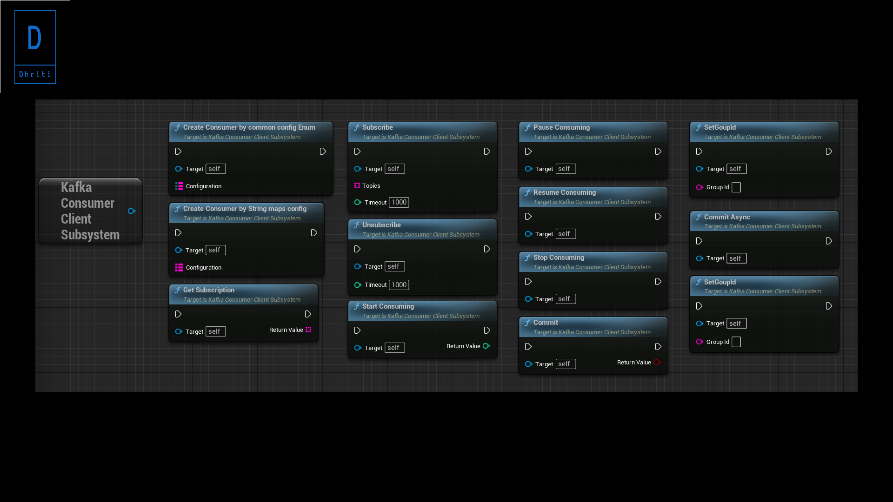
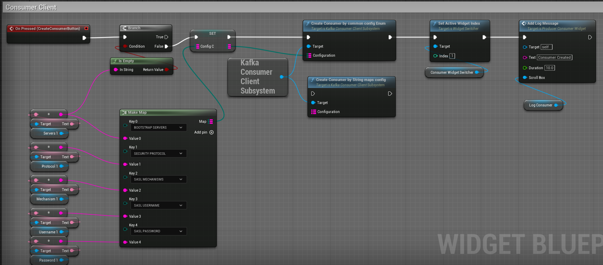
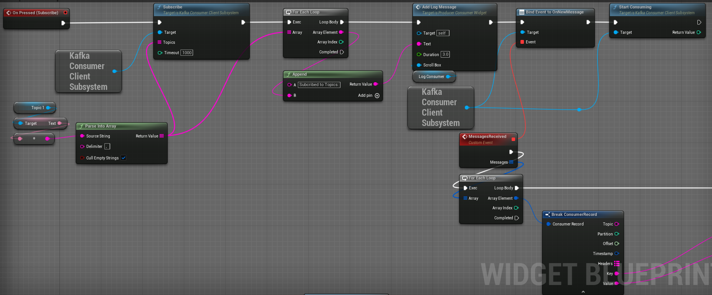
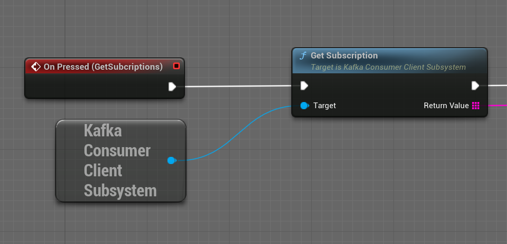
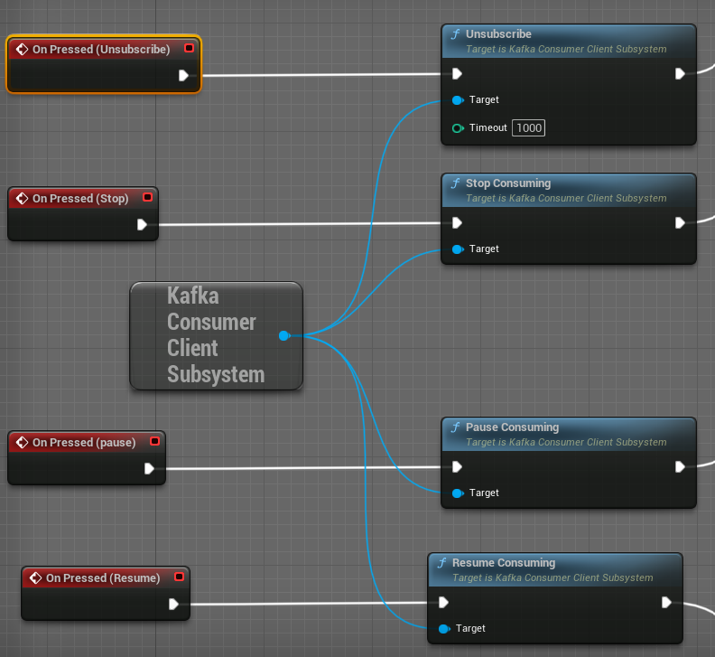


<br>

#  Kafka Producer Client Subsytem

## C++

Create Producer with common raw configuration:

```cpp
#include "KafkaProducerClientSubsystem.h"

UKafkaProducerClientSubsystem* ProducerSubsystem = GEngine->GetEngineSubsystem<UKafkaProducerClientSubsystem>();

TMap<FString, FString> Configuration = { 
		{FString("bootstrap.servers"), FString("<BOOTSTRAP_SERVERS>")},
		{FString("security.protocol"), FString("<SECURITY_PROTOCOL>")},
		{FString("sasl.mechanisms"), FString("<SASL_MECHANISMS>")},
		{FString("sasl.username"), FString("<SASL_USERNAME>")},
		{FString("sasl.password"), FString("<SASL_PASSWORD>")} 
	};

ProducerSubsystem->CreateProducerRaw(Configuration);
```

Create Producer with common Enum configuration:

```cpp
#include "KafkaProducerClientSubsystem.h"

UKafkaProducerClientSubsystem* ProducerSubsystem = GEngine->GetEngineSubsystem<UKafkaProducerClientSubsystem>();

TMap<EKafkaProducerConfig, FString> Configuration = { 
		{EKafkaProducerConfig::BOOTSTRAP_SERVERS, FString("<BOOTSTRAP_SERVERS>")},
		{EKafkaProducerConfig::SECURITY_PROTOCOL, FString("<SECURITY_PROTOCOL>")},
		{EKafkaProducerConfig::SASL_MECHANISMS, FString("<SASL_MECHANISMS>")},
		{EKafkaProducerConfig::SASL_USERNAME, FString("<SASL_USERNAME>")},
		{EKafkaProducerConfig::SASL_PASSWORD, FString("<SASL_PASSWORD>")} 
	};

ProducerSubsystem->CreateProducerUsingEnumConfig(Configuration);
```

Produce Record Async

```cpp
//Produce Record single value
FString Topic = "TestTopic";
FString Value = "HelloWorld";
int64 id = 10;
ProducerSubsystem->ProduceRecordSingleValue(Topic, Value);

//Produce Records Map
TMap<FString, int64> ValueIdPair = {{"valueone", "id1"}, {"valuetwo", "id2"}};
ProducerSubsystem->ProduceRecordsMap(Topic, ValueIdPair);

//Produce Record Struct
FProducerRecord record;
record.Key = "key";
record.Topic = "topic";
record.Value = "value";
record.Id = 2312;
record.Headers = FRecordHeader(
{ 
	{"Header1","Value1"},
	{"Header2","Value2"}
});

ProducerSubsystem->ProduceRecordStruct(record);

//Produce Record list Struct
TArray<FProducerRecord> Records;
ProducerSubsystem->ProduceRecordsStruct(Records);
```

Flush Producer
```cpp
ProducerSubsystem->FlushProducer();
```

Purge Messages
```cpp
ProducerSubsystem->PurgeMessages();
```

## Blueprint

<br>
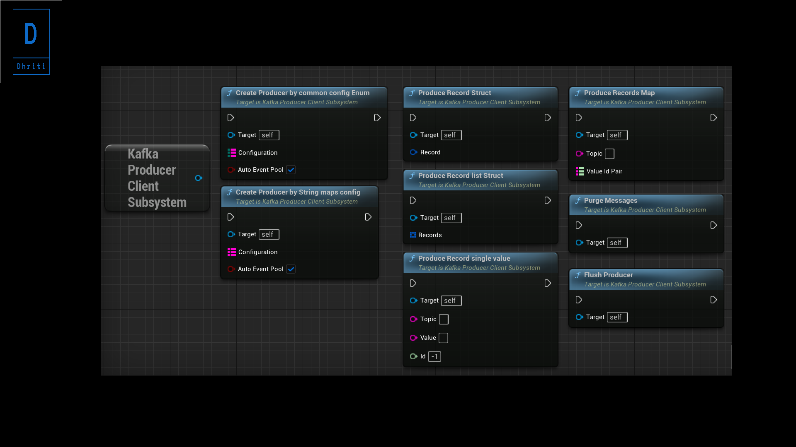
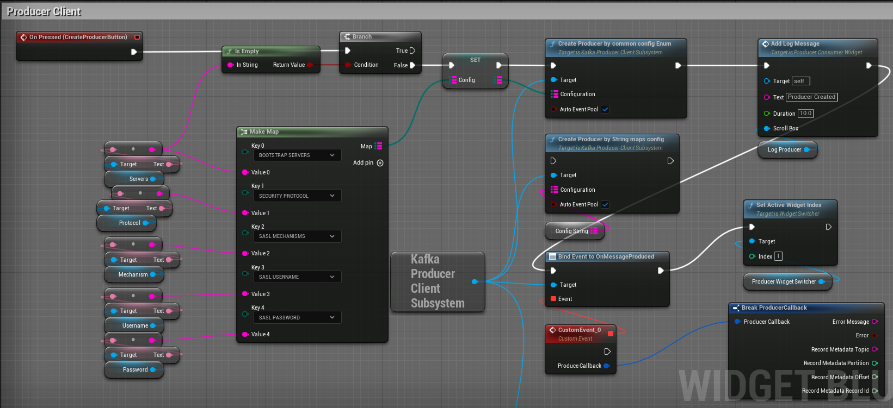
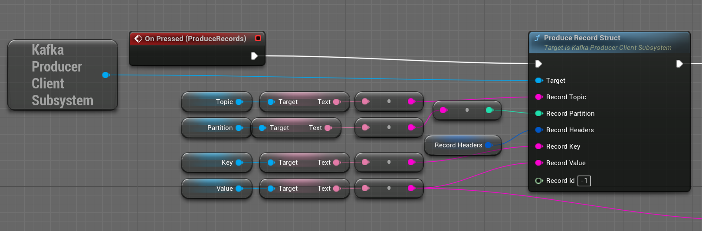

<br>

# Kafka Admin Client Subsytem

## C++
Create Admin with common raw configuration:

```cpp
#include "KafkaAdminClientSubsystem.h"

UKafkaAdminClientSubsystem* AdminSubsystem = GEngine->GetEngineSubsystem<UKafkaAdminClientSubsystem>();

TMap<FString, FString> Configuration = { 
		{FString("bootstrap.servers"), FString("<BOOTSTRAP_SERVERS>")},
		{FString("security.protocol"), FString("<SECURITY_PROTOCOL>")},
		{FString("sasl.mechanisms"), FString("<SASL_MECHANISMS>")},
		{FString("sasl.username"), FString("<SASL_USERNAME>")},
		{FString("sasl.password"), FString("<SASL_PASSWORD>")} 
	};

AdminSubsystem->CreateAdminRaw(Configuration);

```
Create Admin with common Enum configuration:

```cpp
#include "KafkaAdminClientSubsystem.h"

UKafkaAdminClientSubsystem* AdminSubsystem = GEngine->GetEngineSubsystem<UKafkaAdminClientSubsystem>();

TMap<EKafkaAdminConfig, FString> Configuration = { 
		{EKafkaAdminConfig::BOOTSTRAP_SERVERS, FString("<BOOTSTRAP_SERVERS>")},
		{EKafkaAdminConfig::SECURITY_PROTOCOL, FString("<SECURITY_PROTOCOL>")},
		{EKafkaAdminConfig::SASL_MECHANISMS, FString("<SASL_MECHANISMS>")},
		{EKafkaAdminConfig::SASL_USERNAME, FString("<SASL_USERNAME>")},
		{EKafkaAdminConfig::SASL_PASSWORD, FString("<SASL_PASSWORD>")} 
	};

AdminSubsystem->CreateAdminUsingEnumConfig(Configuration);
```
Create Topics:

```cpp

int NumPartitions = 3;
int ReplicationFactor = 3;
TMap<FString, FString> TopicConfig;
int TimeoutMs = 5000;

TArray<FString> Topics;
Topics.Add("TestTopic1");
Topics.Add("TestTopic2");

AdminSubsystem->CreateTopics(Topics, NumPartitions, ReplicationFactor, TopicConfig, TimeoutMs);
```

Delete Topics:

```cpp

int TimeoutMs = 5000;

TArray<FString> Topics;
Topics.Add("TestTopic1");
Topics.Add("TestTopic2");

AdminSubsystem->DeleteTopics(Topics, TimeoutMs);
```

List Topics:

```cpp

int TimeoutMs = 5000;

TArray<FString> Topics = AdminSubsystem->ListTopics(TimeoutMs);
```

Delete Records:

```cpp

FString Topic = "TestTopic1";
int32 partition = 1;
int64 Offsets = 10;
int TimeoutMs = 5000;

AdminSubsystem->DeleteRecords(Topic, partition, Offsets, TimeoutMs);
```

## Blueprint

<br>
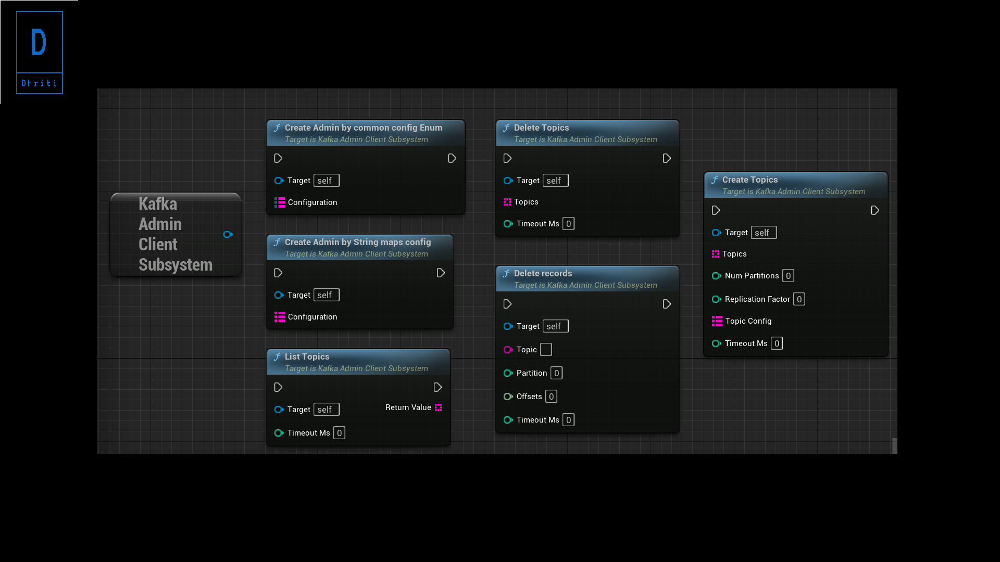
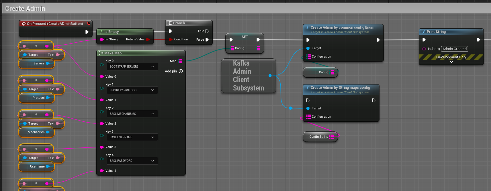
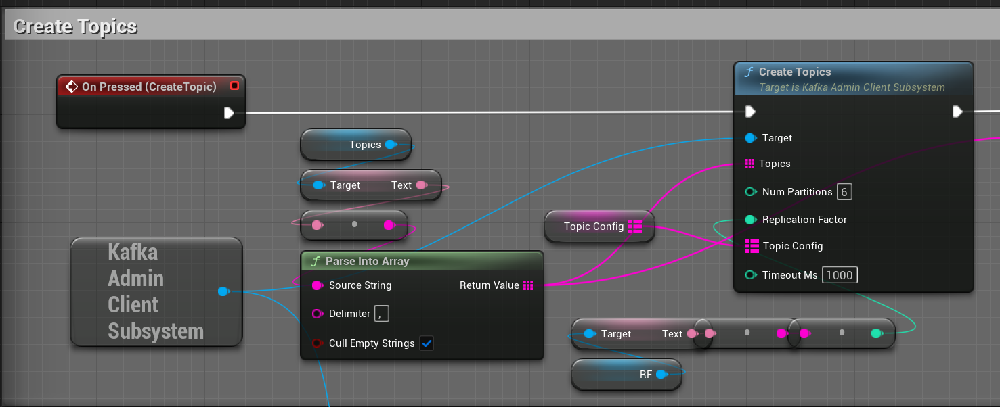
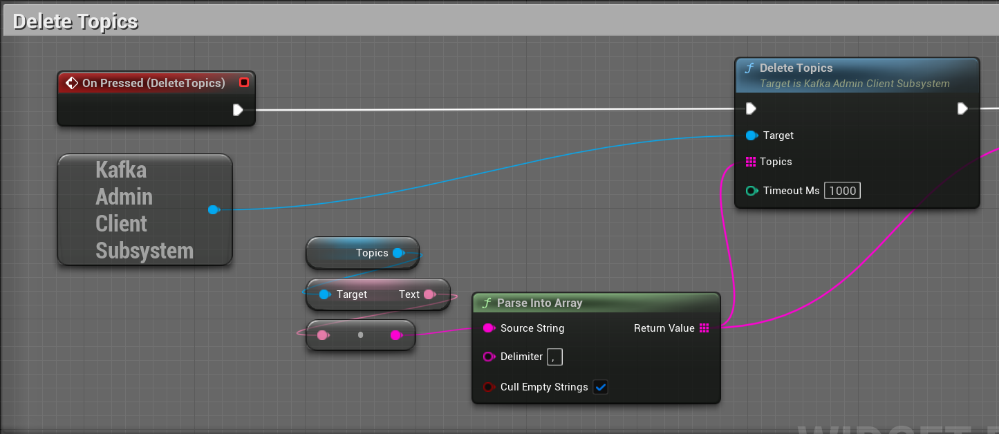
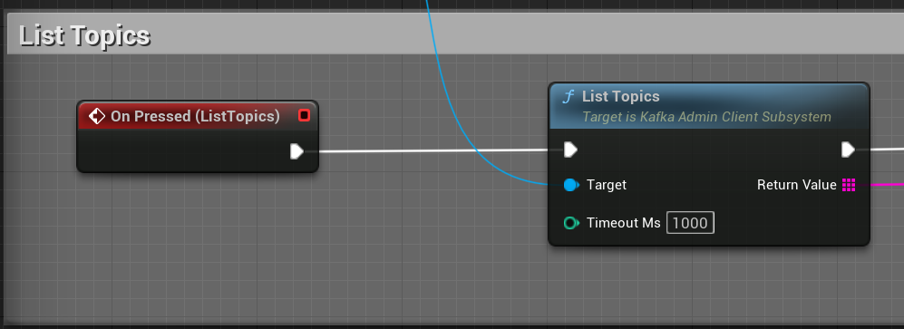
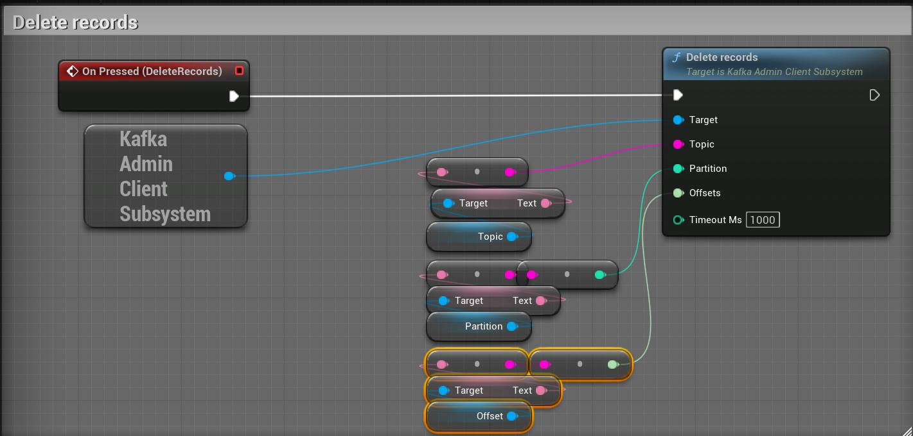

<br>


 <br>

**Note: Some faces issue with installed plugin in Engine follow steps to recompile installed plugin**

1. 	Create an empty C++ project with the Engine version you wish to use.

2.	Bring the plugin(s) to that C++ project
	Create a "Plugins" folder in the C++ project's root folder.
	Copy the plugin(s) folder(UE_5.1\Engine\Plugins\Marketplace\KafkaClientPlugin) you want to build into the newly created "Plugins" folder.

3. 	Delete Binaries and Intermediate folders in plugin.

4.	Compile the C++ project in Visual Studio
	Right click on the project's uproject file and select "Generate Visual Studio project files"

5.	Double click on the *.sln file to launch Visual Studio
	In Visual Studio select Development Editor and Win64 ( same workflow as for building the engine with VS).

6.	Build the project.

7.	Once that's done, copy the plugin from the compiled 
	C++	project to the Engine's plugins folder(UE_5.1\Engine\Plugins\Marketplace\KafkaClientPlugin), and overwrite any conflicting files.

 
<br>

## Thankyou for Visiting>>>

